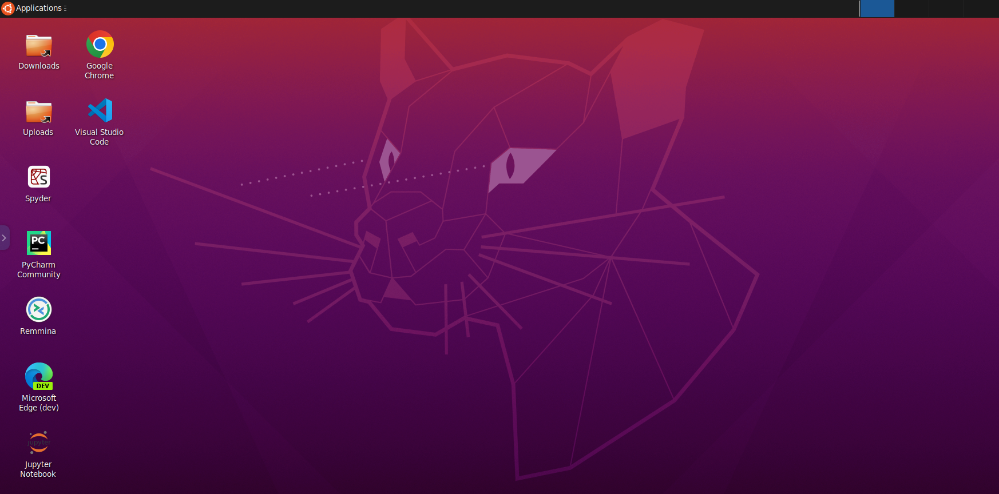
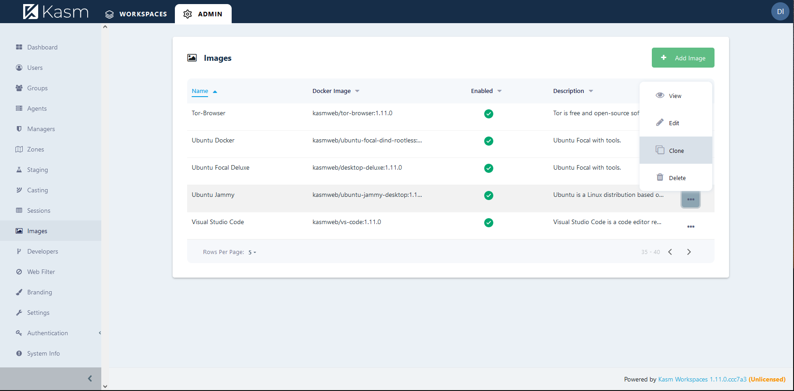
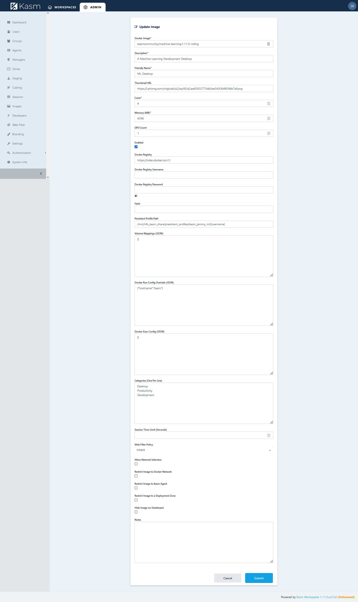
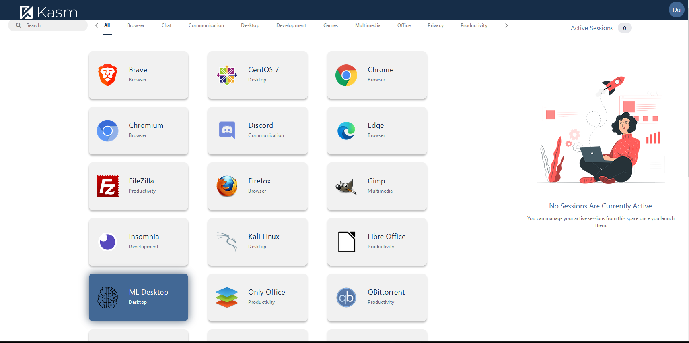

# Kasm Workspaces Machine Learning

This project provides a desktop environment geared for machine learning development. It is meant as an example to using DevOps to provide a secure working environment for machine learning using the Kasm Workspaces platform.




# GPU Support

Kasm Workspaces (formally Kasm Server) version 1.9.0 and higher supports NVIDIA GPUs. The following requirements must be met.
* NVIDIA GPUs with Architecture >= Kepler (or compute capability 3.0)
* NVIDIA container toolkit must be installed on the host

The agent component will report to the API service the number of GPUs and if the Docker daemon is showing the "nvidia" runtime is available. In the Admin panel the Agents view will list all available compute (Agents) available along with the number of GPUs they are reporting. The following screenshot shows a deployment with two Agents, one with a GPU and one without.


# Docker Hub

The docker hub for this project is here: https://hub.docker.com/repository/docker/kasmcommunity/machine-learning


# Manual Deployment ( If you dont have Kasm )

While this image is primarily built to run inside the Kasm Workspaces platform, it can also be executed manually by itself.  Please note that certain functionality, such as audio, web filtering, uploads/downloads, etc, is only available within the Kasm platform.

```
sudo docker run --rm  -it --shm-size=512m -p 6901:6901 -e VNC_PW=password kasmcommunity/machine-learning:1.11.0-rolling
```

The container is now accessible via a browser : `https://<IP>:6901`

 - **User** : `kasm_user`
 - **Password**: `password`


# Adding a new workspace image ( Recommended way )

Add a new Workspace image to the deployment and launch. 
1. Clone the Kasm Desktop Image
2. Change the name field to "kasmcommunity/machine-learning:1.11.0-rolling"
3. Update the Friendly name and description as desired
4. If your system has a GPU, check the require GPU box and set the desired number of GPUs to assign. Set to 0 to assign all available GPUs.
5. Set the desired CPU cores and RAM that shall be assigned to an instance of this image
6. Click Submit to save the changes


First you must clone a image in the list. I picked Ubuntu Jammy in this example.




Next set the feild to the same as in this image. (If you do not need persistent storage then leave that field empty)




Congrates it is now in your list of images. Just let it download as it is a big image.



# Help Us Make It Better

You can help make this better by submitting a pull request with new features and bug fixes.
